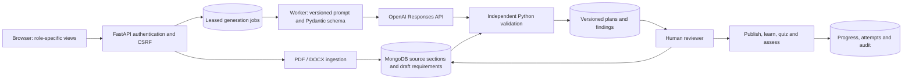
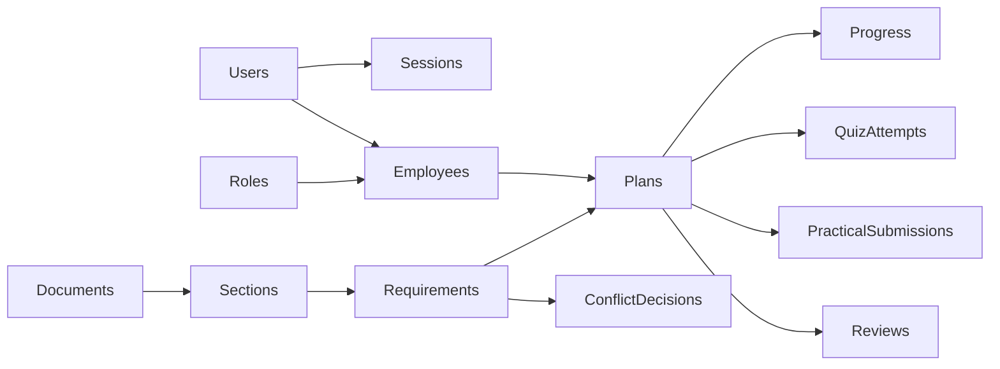
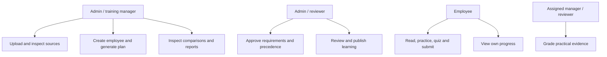
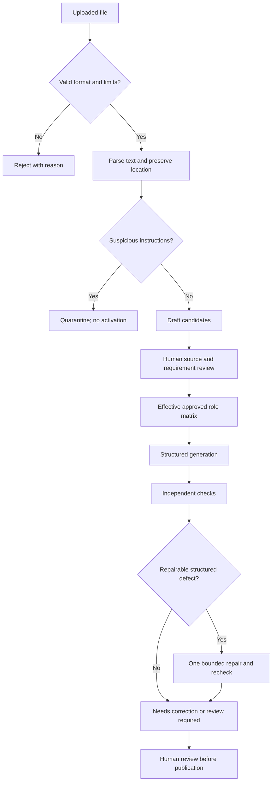

# SkillSprint AI — local competition project report

Prepared 25 September 2026. Organization: fictional AsterBridge Delivery Services. Solo participant. Built with AI assistance declared in AI_USAGE.md; participant review and understanding remain pending. Deployment was explicitly removed from Phase 4 by the project owner.

## Problem, background and purpose

New employees need to learn policies, operational procedures and role obligations. A generic course can omit a mandatory rule, cite an obsolete policy or ask a question with an unsupported answer. A fluent AI lesson can conceal these defects. SkillSprint connects each learning module to a separately reviewed requirement and an immutable source version, so reviewers can inspect both what was generated and why the system considers it supported.

The intended users are administrators, training managers, reviewers, line managers and employees. Their application permissions differ from job roles such as Customer Support Executive or Warehouse Associate. The central demonstration is a policy deadline change: inspect the affected learning, regenerate it, review the new version and preserve only unchanged work.

## Scope and constraints

The implementation uses Python, FastAPI, Jinja2, Pydantic and MongoDB. The interface and database run locally. Uploaded originals remain in private storage outside the static directory. The solo competition timeframe favored one service and one embedded worker over distributed infrastructure. There is no voice transcription dependency, SMTP integration, HRMS connection or automatic grading of free-form practical work.

The SRS includes 63 numbered functional steps, nonfunctional targets and submission deliverables. ACCEPTANCE_MATRIX.csv maps each numbered step to implementation/evidence and limitations. A local evaluation completion is not a claim of complete SRS compliance. Public deployment is excluded by user request; public repository/blog publication and genuine five-day history cannot be manufactured.

## Architecture and module responsibilities



`app/ingestion.py` parses files into stable source spans and creates draft candidates. `app/policy.py` computes effective approved matrices, fingerprints, precedence groups and update deltas. `app/generation.py` calls the real API with bounded retries. `app/worker.py` owns leased jobs, batches generation and performs one bounded repair pass. `app/validation.py` contains independent checks without a model call. `app/training.py` handles review, learning and human assessment. `app/updates.py` serializes publication/progress writes and copies eligible history. `app/comparison.py` measures controlled consistency. `app/phase3.py` serves verification, comparisons, policy impact and CSV reports.

## Database design

MongoDB collections include users, sessions, job_roles, employees, documents, source_sections, requirements, jobs, plans, audit_events, plan_reviews, learning_progress, quiz_attempts, practical_submissions, conflict_resolutions and consistency_experiments. Schema validators require identity/status fields. Unique indexes protect email, document/version, current active policy, employee/login assignment, progress identity and pending practical submissions. Session expiration uses a TTL index as well as an explicit request-time expiry check.

Plans retain matrix and employee-context snapshots. Documents are versioned records rather than overwritten files. Source sections link to original file locations. Growing attempts, reviews and audit events use separate collections. Deterministic copied-record IDs make selective progress migration retry-safe. A short employee write lease prevents publication and learner writes from racing. This is not a general multi-document transaction system.



## Data flow and use cases





```mermaid
sequenceDiagram
  participant Editor
  participant Web
  participant DB as MongoDB
  participant Worker
  participant AI as OpenAI
  Editor->>Web: Generate role plan
  Web->>DB: Persist queued job
  Worker->>DB: Atomically claim lease
  Worker->>DB: Read approved matrix and snapshot
  Worker->>AI: Prompt + bounded requirements + schema
  AI-->>Worker: Structured items or genuine failure
  Worker->>Worker: Check independently; bounded repair if eligible
  Worker->>DB: Persist original evidence, result and findings
  Web->>DB: Read job and plan
  Web-->>Editor: Reviewable output; no automatic approval
```

## Document processing and role matrix

PDF parsing preserves pages and numbered clauses when present. Other text is split into bounded page chunks. DOCX parsing preserves paragraph and table-cell identifiers and splits long spans. Upload size, expanded ZIP size, page count and extracted text limits bound processing. Encrypted/textless PDFs are rejected; OCR is outside this build.

Candidate extraction is deliberately separate from plan generation. Explicitly numbered sample clauses are recognized; unfamiliar documents receive reviewable candidates from obligation language or optional AI extraction. Candidate approval checks that the passage exists in the source. Required fields include role scope, mandatory status, training stage, competency and prerequisites. Reviewed structured rules add a key, value, condition, exception, answer fact, category and assessment topic.

The authored fictional dataset contains 20 current documents, 10 historical versions, 160 requirements, 140 mandatory requirements, 80 role-specific requirements, 10 roles and ten cases each for conflicts, changes and adversarial content. Each full role matrix contains 88 requirements. Reference fixtures are evaluation inputs, not automatically trusted results for unseen organizations.

## Generation and prompt design

The provider adapter uses OpenAI Responses structured parsing and the configured gpt-4.1-mini model. Prompt files are retained by version. The v3 prompt treats sources as untrusted data, constrains IDs and quotations, and requests lessons, checklists, activities, scenarios, quizzes and rubrics. Each request contains at most four requirements. Pydantic enforces bounded fields, valid stages, distinct answer options and an in-range correct answer.

Full plans are assembled across batches. API quota/authentication errors fail explicitly; connection/timeouts and invalid structured outputs have bounded retries. Selected structured-rule failures trigger one additional repair pass. The first output is persisted before repair so an outage does not erase failure evidence. Human review is never replaced by a successful API response.

## Independent validation and comparison

Coverage is unique valid applicable mandatory requirements divided by applicable mandatory requirements. A source or rule mismatch prevents an item from counting as valid coverage. Traceability counts items with valid active source locations and supported quotations. These metrics are different from learning completion.

Checks include IDs, role, mandatory flags, source identity, exact requirement passage, deadlines, prerequisites, dependency cycles, duplicates, structured values, condition/exception excerpts and reviewed quiz answer facts. Conflicts compare reviewed keys under the same condition context; a reviewer chooses precedence with a reason. Decisions expire when the conflict snapshot changes. Unsupported or differently worded free-form claims still require human judgment.

Controlled consistency compares requirement sets, source tuples, module categories and assessment topics using Jaccard overlap. Identical inputs, employee context, model and prompt are required for the aggregate. A high consistency score measures repeatability, not truth. reports/phase4/requirement_comparison.csv contains actual generated requirement-level comparisons from the ten-role run; individual role JSON files preserve requests, outputs, provider metadata and validation.

## Learning and policy updates

A published module requires a read acknowledgement, checklist completion, a passing quiz and passed human practical assessment before it counts as complete. Managers see assigned employees; employees see their own records. Answer keys and expected scenario responses are removed from unattempted employee output. Weak areas produce evidence-linked revision recommendations.

A replacement policy marks affected plans stale. Impact previews identify affected employee modules and learning components. Selective regeneration compares current requirements and employee context with the old matrix. Changed prerequisites invalidate dependent modules. Only byte-equivalent eligible retained learning carries progress into the reviewed new version. Original records remain in history.

## Security, tests and performance

Passwords use Argon2. Sessions are random, server-side and expiring. Mutations require CSRF tokens and role/record authorization. Browser security headers constrain scripts and framing. File paths are generated internally; uploads are not public static assets. CSV formula-like cells are escaped. Sources cannot invoke tools, change permissions or calculate their own coverage.

The phase4 tests add all ten adversarial PDFs, provider timeout/quota/authentication/invalid/refused response cases, unfamiliar DOCX tables and chunking, and archive/macro boundaries. They extend earlier workflow, permission, validation and migration tests. reports/phase4/tests.xml contains executed results. Security findings are scoped to these tests, not a penetration-testing certification.

The local capacity experiment seeds 1,000 employees, 100 roles, 1,000 documents with source sections and requirements, and 1,000 synthetic one-module plans. It measures three requests per route. The unfiltered reports median improved from 20.87 seconds to 3.12 seconds by reusing role matrices per request and limiting active-document checks to applicable sources. No AI response caching is used to conceal latency. The fixture does not simulate 1,000 concurrent users or full-size plans. Short health samples do not prove 99% availability.

## Limitations and future enhancements

The 30-second generation target is not met for full 88-module plans. Lessons and distractors need human review; semantic contradictions and unfamiliar applicability are not completely decided by deterministic checks. Different condition wording is not treated as automatically equivalent. Source-level changes can conservatively regenerate more content than necessary. The report page still performs work proportional to visible versions. Future work can introduce bounded batch parallelism, paginated reporting, richer semantic annotations, additional evaluators and measured cache policies.

Deployment is excluded. Public GitHub/blog publication, a genuine multi-day history, licensing decisions and participant verification remain owner actions. The local walkthrough video is an annotated screen-based replay using saved real model evidence and explicitly synthetic review/progress state; its coverage checklist documents any demonstrations still needing a live participant recording.
